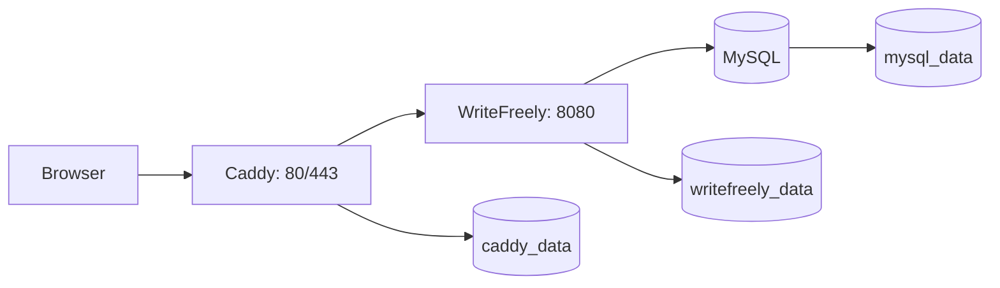

# WriteFreely Platform

[](../../actions/workflows/ci.yml)

Production-oriented Docker Compose deployment for WriteFreely with Caddy,
MySQL, source-built app images, backups, restore workflows, and CI checks.



## What Is Here

- `docker-compose.yml` is the root Compose entrypoint for the local/standalone
  deployment.
- `docker/caddy/` contains the Caddy reverse proxy configuration.
- `docker/writefreely/` contains the custom WriteFreely image and startup
  entrypoint.
- `scripts/` contains backup and restore helpers.
- `docs/` contains production operations notes.
- `assets/themes/` contains WriteFreely custom CSS themes.

## Docker Compose

Copy the example environment file and change the passwords before exposing the
service anywhere public:

```sh
make init
make up
```

For local testing, the default Caddy address is `https://localhost`. Caddy will
serve HTTPS with its local certificate authority, so your browser may warn until
you trust that CA or bypass the warning.

For a real domain, point DNS at the Docker host and set:

```env
CADDY_SITE_ADDRESS=blog.example.com
WRITEFREELY_HOST=https://blog.example.com
```

Then run:

```sh
make up
```

By default, Make targets use the published GHCR image. Pin a specific image
with:

```sh
WRITEFREELY_IMAGE=ghcr.io/ykabbaj/writefreely-platform:v0.1.0 make up
```

For local image development, use the `dev-*` targets:

```sh
make dev-up
make dev-build
make dev-smoke-test
```

You can start from one of the example profiles:

```sh
cp profiles/personal.env .env.profile
docker compose --env-file .env --env-file .env.profile -f docker-compose.yml -f docker-compose.release.yml up -d
```

Available profiles:

- `profiles/personal.env`: closed single-user blog.
- `profiles/community.env`: public multi-user instance with federation.
- `profiles/private.env`: private single-user journal.

Caddy can automatically obtain and renew public HTTPS certificates when the
domain resolves to the host and inbound ports `80` and `443` reach the Caddy
container.

The first start creates `/data/config.ini`, initializes the MySQL schema,
generates WriteFreely keys, and creates the admin user from
`WRITEFREELY_ADMIN_USER` / `WRITEFREELY_ADMIN_PASSWORD`.

Useful shortcuts:

```sh
make up
make logs
make backup
make smoke-test
make restore-test
make sync-backups BACKUP_REMOTE=remote:path
make restore BACKUP=backups/20260502T120000Z
```

See `docs/production-checklist.md` before exposing the service publicly.
See `docs/architecture.md` for the runtime and CI/CD design.
See `docs/deployment.md` for a VPS deployment walkthrough.
See `docs/vps.md` for VPS deployment notes.
See `docs/ansible.md` for automated VPS setup.
See `docs/security.md` for CI vulnerability scanning policy.
See `docs/upgrade.md` before changing WriteFreely versions, and
`docs/restore-test.md` for the restore verification procedure.
