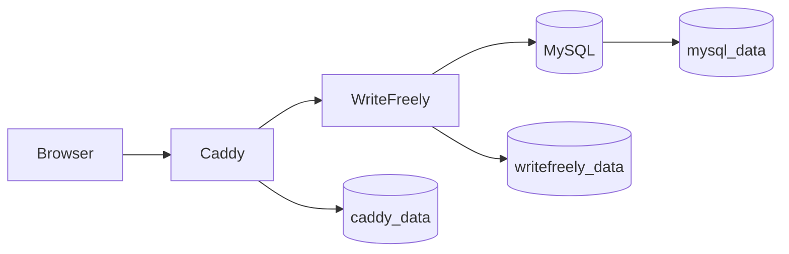

# Architecture

WriteFreely Platform is a single-host Docker Compose deployment that builds and
operates a WriteFreely blog behind Caddy with MySQL persistence.

## Runtime Topology

## Services

- `caddy` terminates HTTPS, serves HTTP/3 when UDP `443` is reachable, and
  reverse proxies to WriteFreely.
- `writefreely` runs the source-built WriteFreely binary, performs first-boot
  setup, runs migrations, and creates the configured admin account.
- `db` stores WriteFreely data in MySQL.

## Network Boundaries

- `public` exposes Caddy to host ports `80` and `443`.
- `proxy` is internal and connects Caddy to WriteFreely.
- `internal` is internal and connects WriteFreely to MySQL.

MySQL is not exposed on host ports. Caddy is the only service attached to the
public network.

## Persistent Data

- `mysql_data` stores database files.
- `writefreely_data` stores `/data/config.ini`, generated keys, and
  initialization markers.
- `caddy_data` stores Caddy certificates and runtime state.
- `caddy_config` stores Caddy configuration state.

The backup workflow captures MySQL as a logical dump and archives the
WriteFreely and Caddy data volumes.

## Image Build

The WriteFreely image is built from the official source tag:

1. Download the `WRITEFREELY_VERSION` source archive.
2. Compile the Go binary with the pinned `GO_VERSION`.
3. Build LESS and ProseMirror assets.
4. Remove build-only Node and Go metadata from the runtime image.
5. Copy the built application into an Alpine runtime image.

Building from source lets the platform move to patched Go releases before
upstream publishes a rebuilt release tarball.

## Startup Flow

1. MySQL starts and reports healthy.
2. WriteFreely waits for MySQL with TLS disabled to match its `tls = false`
   database config.
3. On first boot, WriteFreely writes `/data/config.ini`.
4. It initializes the schema, generates keys, and runs migrations.
5. It creates the configured admin account once.
6. Caddy starts after WriteFreely is healthy.

## Backup And Restore

`make backup` writes:

- `mysql.sql`
- `writefreely_data.tgz`
- `caddy_data.tgz`
- `manifest.txt`

`make restore` stops app writers, restores archived volumes, starts MySQL,
waits for readiness, imports the database dump, and restarts the application
services.

`make restore-test` proves the process end to end with a disposable Compose
project. It boots a test stack, backs it up, deletes test volumes, restores
into fresh volumes, waits for HTTPS to respond, and tears the test stack down.

## CI/CD Flow

Pull requests and pushes run:

- Compose rendering checks.
- Shell syntax checks.
- ShellCheck, Hadolint, Yamllint, and Markdownlint.
- Docker image build.
- Runtime smoke test.
- Trivy OS and library scans.

The publish workflow runs on version tags and manual dispatch:

- build image
- scan image
- smoke test
- restore test
- publish to GHCR

A scheduled workflow runs the restore test weekly to continuously exercise the
disaster recovery path.

## Security Model

- WriteFreely runs as a non-root user.
- The app container drops Linux capabilities.
- Services use `no-new-privileges`.
- MySQL is reachable only on the internal Docker network.
- CI blocks fixed high and critical vulnerabilities reported by Trivy.
- Secrets live in `.env`, which is ignored by git.
